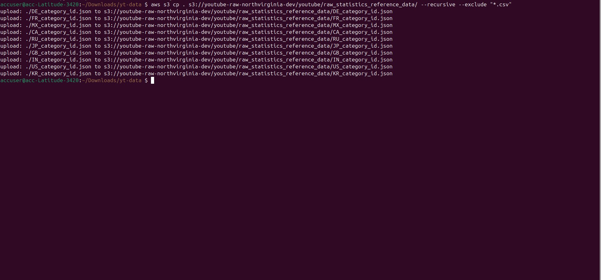
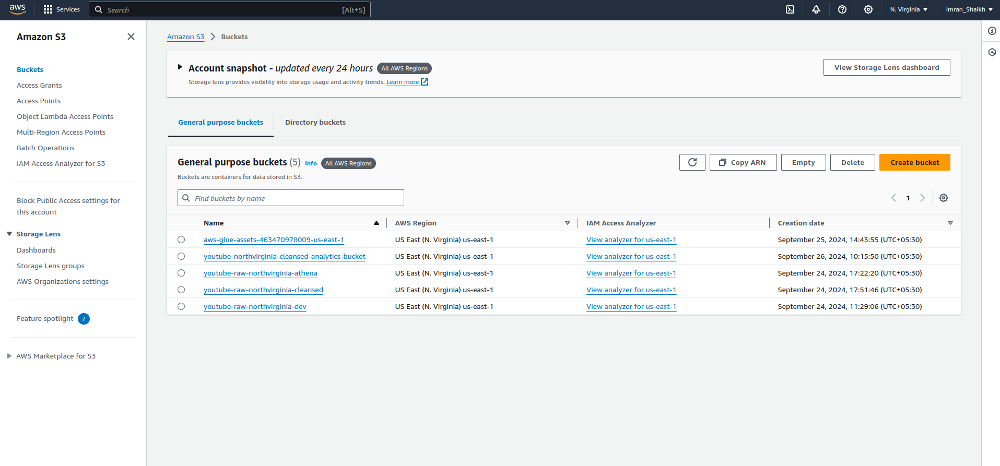
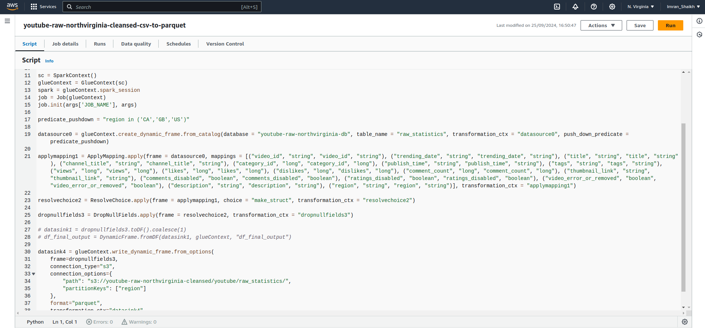
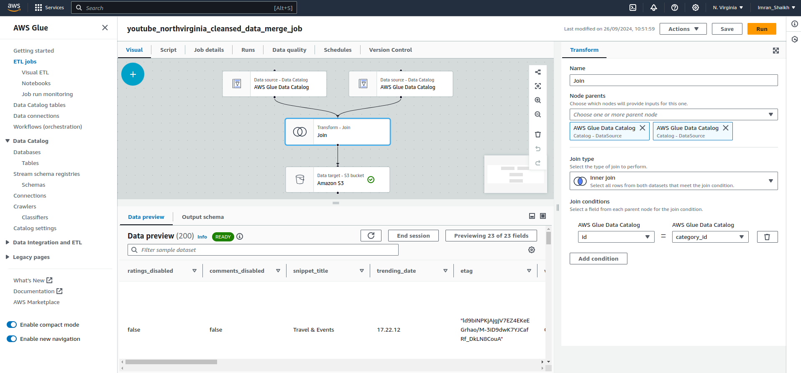
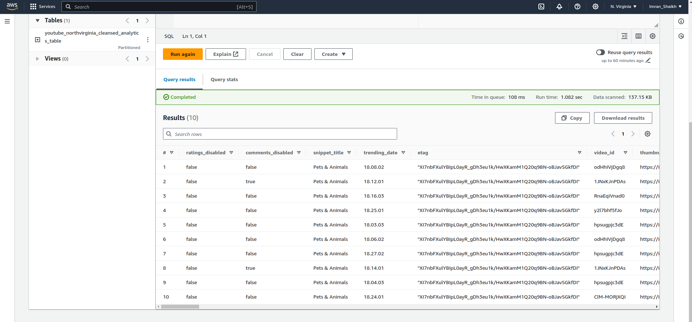
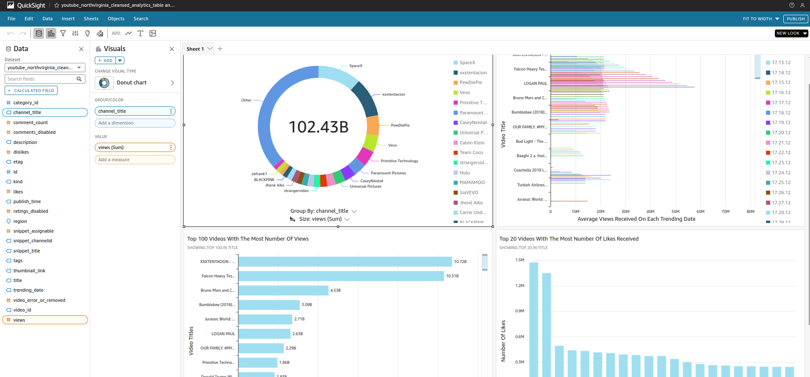
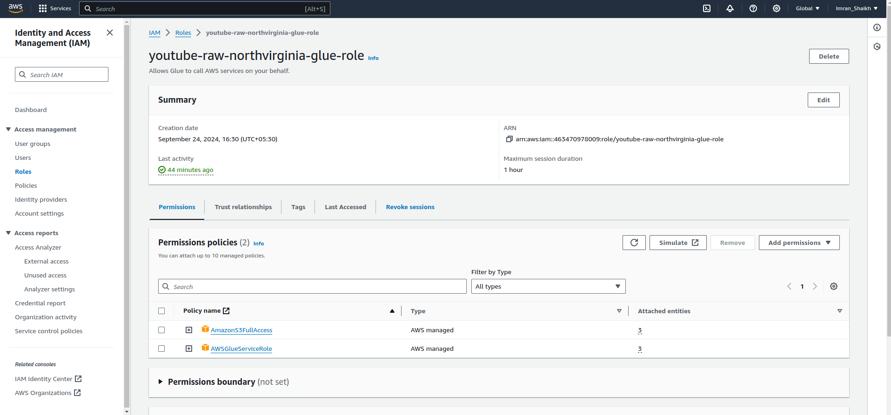
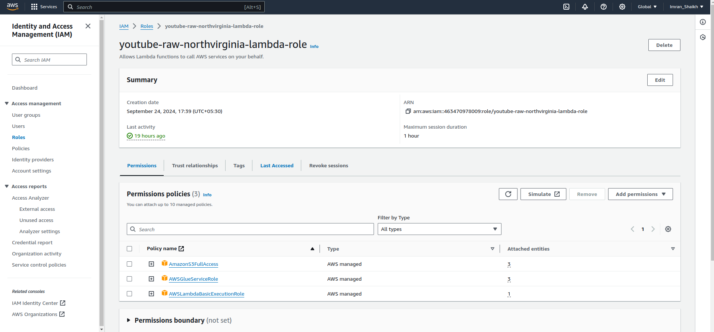
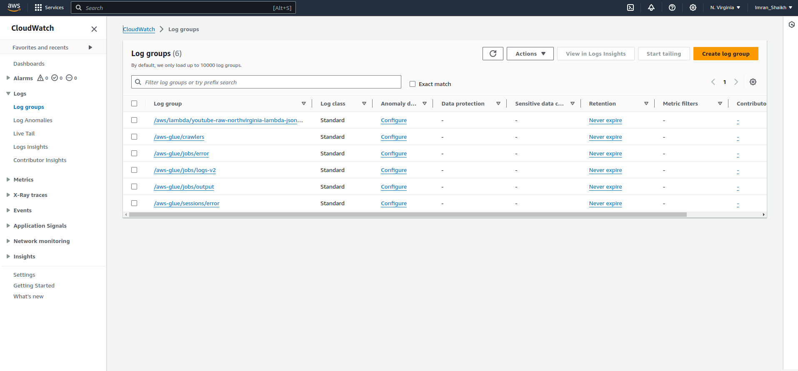

# End-to-End Data Engineering ETL and Youtube Data Analysis Project By Imran Shaikh

## Overview

This project aims to securely manage, streamline, and perform analysis on the structured and semi-structured YouTube videos data based on the video categories and the trending metrics.

## Project Goals
1. Data Ingestion — Build a mechanism to ingest data from different sources
2. ETL System — We are getting data in raw format, cleaning it, and transforming this data into the parquet format for analysis.
3. Data lake — We will be getting data from multiple sources so we need a centralized repository to store them.
4. Scalability — As the size of our data increases, we need to make sure our system scales with it.
5. Cloud — We can’t process vast amounts of data on our local computer so we need to use the cloud, in this case, I have used AWS.
6. Reporting — Build a dashboard to get answers to the questions.

## Project Architecture

## Services used
1. **AWS CLI:** The AWS CLI (Command Line Interface) is a tool that allows you to interact with AWS services from the command line.

    **Using awscli to ingest raw data into the S3 bucket:**

2. **Amazon S3:** Amazon S3 is an object storage service that provides manufacturing scalability, data availability, security, and high performance.

    **Using S3 As Data Lake with various zones i.e (Raw, Cleansed, and Analytics Zone):**

3. **AWS Lambda:** Lambda is a computing service that allows programmers to run code without creating or managing servers.

    **a. Using Lambda Trigger to trigger the Lambda function as soon as PUT object event occurs in S3 raw data bucket**

    
    
    **b. Using Lambda function to cleanse, transform and convert raw JSON data into Parquet format for analysis.**

    

4. **AWS Glue:** A serverless data integration service that makes it easy to discover, prepare, and combine data for analytics, machine learning, and application development.
    
    **a. Using Glue-Job script to cleanse, transform, and convert raw CSV data into Parquet format for analysis.**

    
    
    **b. Using Glue-Visual-Job to merge both CSV and JSON cleansed parquet data and saved it into the Analytics bucket for analysis**
    
    
    
5. **AWS Athena:** Athena is an interactive query service for S3 in which there is no need to load data it stays in S3.

    **Ran test analysis on analytics bucket data using Athena to ensure that data is ready for analysis**

    
6. **AWS QuickSight:** Amazon QuickSight is a scalable, serverless, embeddable, machine learning-powered business intelligence (BI) service built for the cloud.

    **Performed analysis on the final analytics data using the Amazon Quicksight**

    

    **Demonstration Video:**
    [Watch Video](https://drive.google.com/file/d/10MdkVHa9b0Y0p2mp7_Ife4oVM0V0bNRw/view?usp=drive_link)

7. **AWS IAM:** This is nothing but identity and access management which enables us to manage access to AWS services and resources securely.

    **IAM Roles:**

    
    
8. **AWS CloudWatch:** Amazon CloudWatch is a monitoring and observability service provided by AWS. It helps you monitor your AWS infrastructure, applications, and services in real-time by collecting and tracking metrics, logs, and events.

    **Using CloudWatch to monitor logs and error of my project**

    

## Dataset Used
This Kaggle dataset contains statistics (CSV files) on daily popular YouTube videos over the course of many months. There are up to 200 trending videos published every day for many locations. The data for each region is in its own file. The video title, channel title, publication time, tags, views, likes and dislikes, description, and comment count are among the items included in the data. A category_id field, which differs by area, is also included in the JSON file linked to the region. 

https://www.kaggle.com/datasets/datasnaek/youtube-new

## Author

### Imran Shaikh
